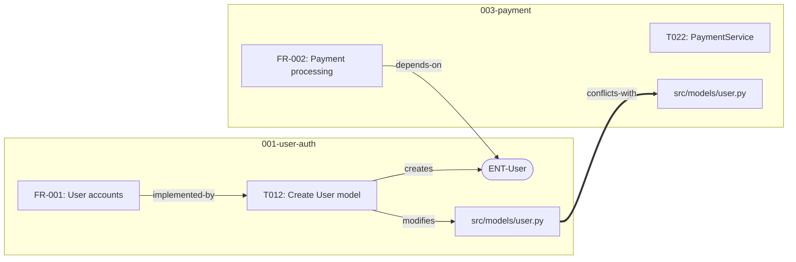

## User Input

```text
$ARGUMENTS
```

You **MUST** consider the user input before proceeding (if not empty).

## Goal

Render the dependency graph (per-feature or global) as a Mermaid diagram for visual inspection. The diagram helps developers understand component relationships, identify hub modules, spot cross-feature dependencies, and communicate architecture to stakeholders.

## Operating Constraints

- **Read-only**: Do not modify any files. Output Mermaid diagrams inline.
- **Graph-dependent**: Requires `.specify/graphs/index.json` or a per-feature `dependency-graph.json` to exist.

## Execution Steps

### 1. Determine Scope

Parse `$ARGUMENTS` to determine what to visualize:

- **No arguments or `--global`**: Visualize the entire global graph at `.specify/graphs/index.json`
- **`--feature NNN-name`**: Visualize only a specific feature's graph at `specs/NNN-name/dependency-graph.json`
- **`--current`**: Visualize the current feature branch's graph
- **`--conflicts`**: Visualize only conflict edges (CRITICAL and HIGH severity)
- **`--type requirement|task|entity|file|endpoint|decision|nfr|threat`**: Filter to show only nodes of a specific type
- **`--hub`**: Show only hub nodes (fan-in above threshold) and their connections
- **`--diff SNAPSHOT_FILE`**: Compare current graph against a snapshot and highlight differences

### 2. Load Graph Data

Load the appropriate graph JSON based on scope. If graph doesn't exist, instruct user to run `/speckit.depgraph.discover` or `/speckit.depgraph.impact` first.

### 3. Apply Filters

Based on arguments, filter the graph:
- Remove nodes/edges outside the requested scope
- If the filtered graph still has more than 100 nodes, summarize:
  - Collapse file nodes by directory (show directory as single node with file count)
  - Collapse tasks by phase (show phase as single node with task count)
  - Keep entity, endpoint, and requirement nodes individual

### 4. Generate Mermaid Diagram

Produce a Mermaid `graph` diagram with these conventions:

**Node Shapes by Type**:
- Requirements: `FR001["FR-001: User account creation"]` (rectangle)
- Entities: `ENTUser(["ENT-User"])` (stadium/rounded)
- Files: `FILEsrc["src/models/user.py"]` (rectangle)
- Endpoints: `EPpost{{"EP: POST /api/users"}}` (hexagon)
- Tasks: `T012["T012: Create User model"]` (rectangle)
- Decisions: `ADR001[/"ADR-001: Use PostgreSQL"/]` (parallelogram)
- Threats: `THR001>"THR-001: SQL Injection"]` (asymmetric)

**Edge Labels**:
- Show the relation type as edge label
- Conflict edges use thick arrows: `==>`

**Grouping**:
- Group nodes by feature using `subgraph`
- Label each subgraph with feature name

**Example output**:

````markdown

````

### 5. Add Summary Legend

After the diagram, include a text summary:

```markdown
**Graph Statistics**:
- Nodes rendered: [N] (of [M] total)
- Edges rendered: [N] (of [M] total)
- Features shown: [list]
- Filters applied: [list]
- Hub nodes: [list with fan-in counts]

**Legend**:
- Rectangles: Requirements, Tasks, Files
- Rounded: Entities
- Hexagons: Endpoints
- Thick arrows (==>): Conflict edges
```

### 6. Diff Mode (if `--diff` specified)

When comparing against a snapshot:
- Nodes added since snapshot: highlight with a note
- Nodes removed since snapshot: list separately
- Edges added/removed: annotate in diagram
- Output a change summary:

```markdown
### Graph Changes Since [snapshot date]

| Change | Count | Details |
|--------|-------|---------|
| Nodes Added | [N] | [list] |
| Nodes Removed | [N] | [list] |
| Edges Added | [N] | [list] |
| Edges Removed | [N] | [list] |
```

## Guidelines

- Keep diagrams readable — prefer clarity over completeness
- For large graphs (100+ nodes), always summarize
- Use left-to-right (`graph LR`) for wide dependency chains, top-to-bottom (`graph TB`) for hierarchical views
- Mermaid renders natively in GitHub, Azure DevOps, and most Markdown editors
- Do not use style/class definitions — let the default theme handle colors
