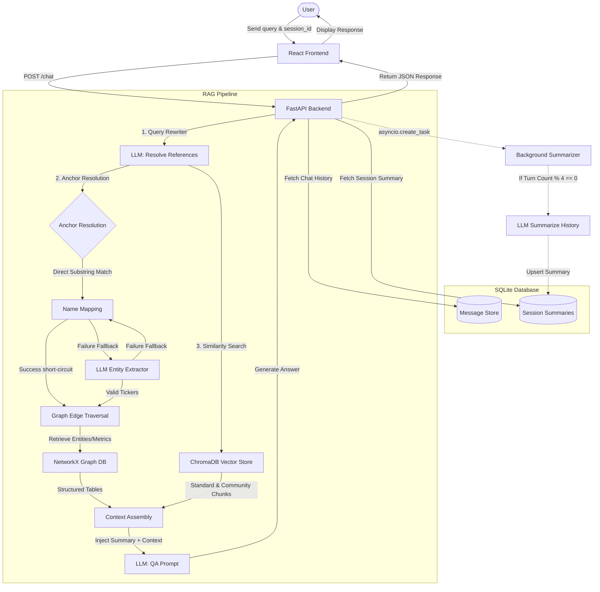

# 🚀 NIFTY 50 FinBot: Hybrid Graph-Vector RAG Chatbot

FinBot is a state-of-the-art financial research assistant built using a **Hybrid Graph-Vector RAG (Retrieval-Augmented Generation)** architecture. It maps and analyzes corporate metrics, leadership connections, sector distributions, and shareholding patterns for all 50 companies listed on the **National Stock Exchange of India (NSE) NIFTY 50** index.

---

## ⚙️ System Design & Architecture

FinBot is designed as a modular web application with an API-driven backend and a responsive single-page frontend.

### 🗺️ System Flow & Architecture Diagram



### 1. API Structure
The backend is powered by **FastAPI** and exposes the following endpoints:
- `POST /chat`: Receives the user message and `session_id`. Orchestrates history retrieval, hybrid RAG context assembly, LLM QA generation, and schedules the background summarizer.
- `GET /sessions`: Lists all active session IDs, including message counts and first-message content previews.
- `GET /history/{session_id}`: Retrieves the sequential history of messages for a session.
- `GET /summary/{session_id}`: Retrieves the stored cumulative session summary.
- `DELETE /history/{session_id}`: Deletes all message logs and summary details for the specified session.
- `DELETE /sessions`: Clear-all endpoint to wipe out all chats and summaries.
- `GET /health`: Returns service health status and chatbot engine readiness.

### 2. Session Handling & Memory
- **Persistent History**: Message history is stored in SQLite via LangChain's `SQLChatMessageHistory`.
- **Background Memory Summarization**: To prevent context window bloat during long chats while preserving conversational details, the system executes an asynchronous background task (`_maybe_summarize`) via Python's `asyncio.create_task`.
- **Summary Updates**: Every 4 turns, the worker compiles the conversation history, uses the LLM to generate a concise summary (max 120 words), and upserts it in the SQLite `session_summaries` table.
- **Memory Injection**: Upon processing a new query, the latest summary is loaded and injected into the QA system prompt under `session_summary` to provide long-term history context.

### 3. Fallback Chain & Short-Circuit Optimization
To optimize latency and handle API failures gracefully, the hybrid retrieval pipeline implements multiple fallbacks:
- **Entity Anchor Resolution**:
  1. *Direct Substring Matching*: It first matches query words against graph entity IDs or mapped full company names (e.g. "Infosys Limited" -> `INFY`).
  2. *LLM Skip Short-Circuit*: If a company match is found verbatim, the LLM-based structured entity extraction is bypassed entirely, improving response latency.
  3. *LLM Extraction Fallback*: If substring matching yields no company nodes, it invokes the LLM with structured output (`EntityExtraction`) to identify tickers.
  4. *Recovery Fallback*: If the LLM extraction fails (e.g., rate limits or parser errors), the system falls back to any identified substring entity anchors.
- **Resilient Data Retrieval**: The retriever executes ChromaDB vector search and NetworkX graph searches inside isolated `try/except` blocks. If either database is unavailable or fails, the bot continues processing using the surviving data source.

---

## 🏗️ ML Architecture Overview

FinBot combines the strengths of structured Knowledge Graphs and unstructured Vector Search:

1. **Knowledge Graph (NetworkX)**: Models structured entities (Companies, Sectors, Directors) and quantitative financial metrics (Revenue, Profit, Shareholding %) as nodes and edges.
2. **Vector Store (ChromaDB)**: Houses semantic chunks of unstructured company descriptions and Wikipedia records embedded using `BAAI/bge-small-en-v1.5`.
3. **Community Detection & Summarization (Ollama)**: Automatically clusters graph sub-sections (using Louvain communities) and generates summaries using a local LLM (`llama3.2:3b`) to answer multi-hop or macro-level financial queries.
4. **Hybrid Retrieval**: Standard semantic documents and graph-level properties are retrieved in parallel to compile a comprehensive context window for the user query.

---

## 📊 Evaluation Results

FinBot includes an automated evaluation harness in [evaluate_rag.py](file:///Users/tanvi/Desktop/FinBot/backend/evaluate_rag.py) using an LLM-as-a-judge (evaluating faithfulness, answer relevance, and completeness on a 1–5 scale) and tracking retrieval performance and latency.

Below are the latest evaluation results compiled from [rag_eval_results.xlsx](file:///Users/tanvi/Desktop/FinBot/backend/rag_eval_results.xlsx):

### 📈 Overall Key Performance Indicators (KPIs)
- **Total Questions Evaluated**: 21
- **Error Rate**: 0.0%
- **Anchor Hit Rate**: 63.2%
- **Average Latency**: 170.33 seconds
- **P90 Latency**: 258.73 seconds
- **Average Faithfulness**: 3.57 / 5
- **Average Answer Relevance**: 3.67 / 5
- **Average Completeness**: 2.86 / 5
- **Overall Average Score**: 3.37 / 5

### 🗂️ Category-wise Performance Breakdown

| Category | Questions | Avg Faithfulness | Avg Answer Relevance | Avg Completeness | Avg Score | Avg Latency (s) | Error Rate % | Anchor Hit Rate % |
| :--- | :---: | :---: | :---: | :---: | :---: | :---: | :---: | :---: |
| **Single-Company Factual** | 5 | 3.80 | 4.20 | 3.20 | 3.73 | 161.40 | 0.0% | 40.0% |
| **Comparison** | 3 | 3.33 | 3.00 | 2.67 | 3.00 | 250.67 | 0.0% | 66.7% |
| **Sector** | 3 | 4.00 | 5.00 | 3.00 | 4.00 | 136.37 | 0.0% | 100.0% |
| **Financial Metric** | 3 | 3.33 | 3.00 | 2.67 | 3.00 | 199.43 | 0.0% | 33.3% |
| **Leadership** | 2 | 4.00 | 4.00 | 2.50 | 3.50 | 155.15 | 0.0% | 100.0% |
| **Shareholding** | 2 | 3.00 | 3.00 | 3.00 | 3.00 | 122.70 | 0.0% | 50.0% |
| **Robustness** | 2 | 3.00 | 3.00 | 3.00 | 3.00 | 110.99 | 0.0% | N/A |
| **Multi-turn Sim** | 1 | 4.00 | 3.00 | 2.00 | 3.00 | 232.85 | 0.0% | 100.0% |

---

## 📁 Project Structure

```text
FinBot/
├── backend/                  # FastAPI Python backend application
│   ├── main.py               # Main API endpoints (chat, history, sessions)
│   ├── retriever.py          # Hybrid retrieval logic combining Graph & Vector DB
│   ├── ingest.py             # Parses documents and creates networkx graph + vector database
│   ├── communities.py        # Detects communities and runs Ollama summaries
│   ├── evaluate_rag.py       # RAG automated evaluation harness (LLM-as-judge)
│   └── visualize_graph.py    # Generates interactive network HTML visualization
├── frontend/                 # Vite + React + Tailwind CSS client application
│   ├── src/                  # React source files (App.jsx chatbot layout)
│   ├── public/               # Static assets
│   └── vercel.json           # Vercel SPA rewrite routing rules
├── data/                     # Source documents and database persistence
│   ├── docs/                 # Wiki pages & raw financial data
│   ├── chromadb/             # Pre-built ChromaDB vector collection (Git-tracked)
│   ├── networkx/             # Pre-built NetworkX graph files (Git-tracked)
│   └── communities/          # Pre-built community summaries JSON (Git-tracked)
├── .env                      # Global backend environment configurations
├── fetch_data.py             # Scrapes Wikipedia pages and fetches yfinance data
├── pyproject.toml / uv.lock  # Python dependencies managed via uv package manager
└── run_pipeline.sh           # Executable script running the complete ingestion pipeline
```

---

## 🛠️ Local Setup

### Prerequisites
- [uv](https://github.com/astral-sh/uv) (Fast Python package manager)
- [Node.js & npm](https://nodejs.org/)
- [Ollama](https://ollama.com/) (For generating new community summaries locally)

### 1. Clone & Install Python Dependencies
```bash
# Clone the repository
git clone <your-repo-url>
cd FinBot

# Sync dependencies and create a working .venv automatically
uv sync
```

### 2. Configure Environment Variables
Create a `.env` file in the root directory:
```env
# LLM Providers (Required for Chat API)
GROQ_API_KEY=your_groq_api_key
GEMINI_API_KEY=your_gemini_api_key

# Local LLM config (For community clustering / local run)
OLLAMA_BASE_URL=http://127.0.0.1:11434/v1
OLLAMA_MODEL=llama3.2:3b

# Paths (Keep defaults for local development)
NETWORKX_GRAPH_PATH=data/networkx/nifty_graph.pkl
CHROMA_PATH=data/chromadb
CHAT_DB_URL=sqlite:///./nifty_chat_history.db

# HuggingFace Token (For embeddings)
HF_TOKEN=your_huggingface_token
```

### 3. Run Ingestion Pipeline (Optional)
The pre-built vector database and graph pickle files are already tracked in Git inside the `data/` folder, so you don't need to rebuild them to get started. If you want to update the data:
1. Ensure Ollama is running locally and you have the model pulled:
   ```bash
   ollama pull llama3.2:3b
   ```
2. Execute the pipeline script:
   ```bash
   ./run_pipeline.sh
   ```

---

## 🚀 Running the Application Locally

### Start Python Backend
From the root directory:
```bash
uv run python backend/main.py
```
The server will start at `http://127.0.0.1:8000`.

### Start React Frontend
In a new terminal window, navigate to the frontend directory:
```bash
cd frontend
npm install
npm run dev
```
The dev server will spin up (typically at `http://localhost:5173`).
