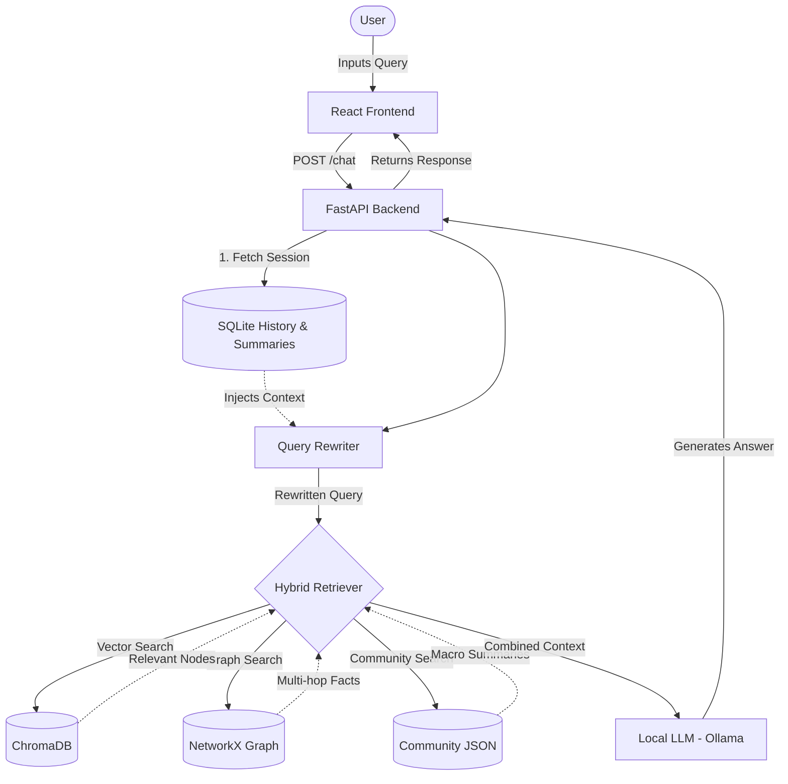

# NIFTY FinBot

NIFTY FinBot is an advanced financial research assistant powered by a custom GraphRAG (Retrieval-Augmented Generation) pipeline. It provides multi-hop reasoning over the NIFTY 50 index, incorporating company financial statements, Wikipedia context, and a NetworkX knowledge graph. 

## Architecture Workflow

### Workflow Summary
1. **User Interaction**: The user enters a query in the React frontend, which sends the query and a `session_id` to the FastAPI backend.
2. **Contextualization**: The backend fetches the previous conversation history and its background summary from SQLite. An LLM query rewriter processes the history alongside the user's input to create a fully standalone search query, resolving all pronouns and implicit references.
3. **Hybrid Graph Retrieval**: The standalone query hits the Hybrid Retriever, which queries three distinct sources simultaneously:
   - **ChromaDB**: Performs a semantic similarity search to grab relevant chunks and Wikipedia embeddings.
   - **NetworkX**: Traverses structural graph edges to pull in concrete data points (e.g., quarterly revenue figures, CEO mappings).
   - **Community JSON**: Fetches pre-computed multi-hop sector trends and community overviews.
4. **LLM Generation**: All retrieved contexts and facts are merged into a strictly formatted prompt. A local Ollama instance (e.g., Llama 3.2 or Mistral) reasons over this massive context to generate a highly accurate, brief, and factual response.
5. **UI Delivery**: The response is streamed back to the frontend, instantly displayed via a real-time custom typewriter effect, and permanently stored in SQLite.

## Key Features
- **Hybrid Retrieval System:** Combines ChromaDB vector search with a NetworkX structured knowledge graph to understand multi-company relationships.
- **Community GraphRAG:** Pre-computes high-level community summaries for broader analytical insights across sectors and metrics.
- **Persistent Sessions:** Full history-awareness backed by SQLite. The backend automatically summarizes past interactions in the background to provide the LLM with perfect context.
- **Premium UI:** A modern, glassmorphic React frontend featuring real-time typewriter effects, auto-scrolling, and responsive sidebar navigation.
- **Local LLM Support:** Seamlessly integrated with Ollama for local inference (Llama 3.2 / Mistral).

## Setup
1. Clone the repository.
2. Install Python dependencies: `pip install -r requirements.txt`
3. Install Frontend dependencies: `cd frontend && npm install`
4. Setup environment variables in `.env`
5. Run the backend: `uv run uvicorn main:app`
6. Run the frontend: `npm run dev`

## Tech Stack
- **Frontend:** React, Vite, TailwindCSS, Lucide-React
- **Backend:** FastAPI, SQLite, Uvicorn
- **AI/RAG:** LangChain, HuggingFace Embeddings, Ollama, Chroma, NetworkX
